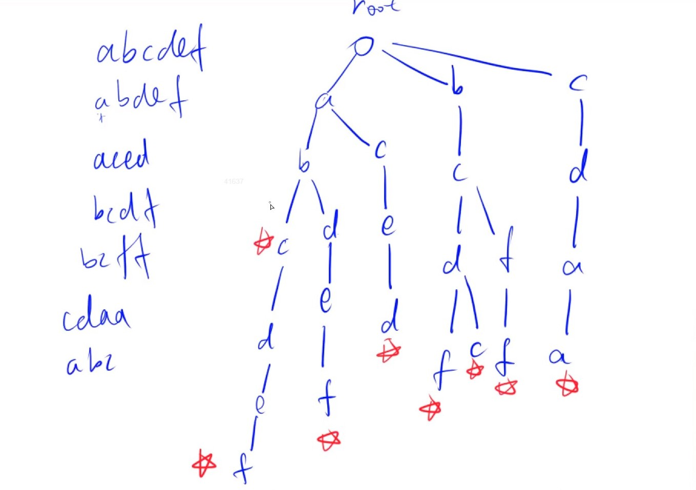

### Trie树

​	用途：快速存储和查找字符串集合的数据结构



```c++
#include <iostream>
using namespace std;

const int N = 100010;

//cnt[N] 以当前节点为结尾的单词个数
// 下标时0的点，既是根节点，又是空节点
int son[N][26], cnt[N], idx; 

// 在Trie树中插入单词
void insert(char str[]){
    int p = 0;
    for(int i = 0; str[i]; ++i){
        int u = str[i] - 'a';
        if(!son[p][u]) son[p][u] = ++idx; // idx相当于时一个编号具体
        p = son[p][u];
    }
    cnt[p]++;
}

int query(char str[]){
    int p = 0;
    for (int i = 0; str[i]; ++i){
        int u = str[i] - 'a';
        if(!son[p][u]) return 0;
        p = son[p][u];
    }
    return cnt[p];
}

```

```C++
/**
关于理解int son[N][26] 这个二维数组的心得

Tire树本质上一个多叉树，最多可以分多少叉呢？因为此题存的都是小写字母，所以是26叉；

这里就解释了son这个二维数组的第二维的含义，就是他最多有26个孩子，那么他是谁呢，他当然是结点了，那结点之间怎么区分，或者这些孩子的爸爸叫啥，爸爸们用下标来区别，所以第一维就是爸爸们的id，son[0][1]含义就是0号爸爸有个儿子b ，那son[0][1] = 2，就是0号爸爸有个儿子b，儿子的id是2； 这些id就是由idx` 来赋值的；

idx可以理解为计划生育的管理局的给上户口的，生一个孩子，给孩子上身份证，证件上ID 为++idx ，而孩子叫啥，其实就是26个小写字母中的其中一个了；

对于每个结点而言，可以知道他有没有这个孩子，有的话叫啥，在哪里；

对于查询，从根节点一路查下来，就可以找到某个字符串在不在；

对于插入字符串，也是一路下来，看有没有这个儿子，没有了给你生个儿子，有了继续给下面找，所以只插入该字符串中原来不存在的字符即可； 也就是利用了公共前缀来降低查询时间的开销以达到提高效率的目的;
**/
```

